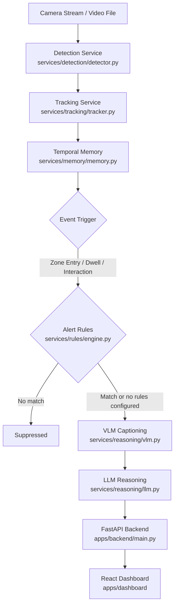

# Eagle Architecture Reference

Eagle is an event-driven surveillance reasoning pipeline that converts raw video frames into natural-language risk assessments. Frames enter the detection layer (`services/detection/detector.py`), tracked entities are persisted across time (`services/tracking/tracker.py`), recent events are stored in Redis (`services/memory/memory.py`), and only meaningful behavioral changes trigger multimodal reasoning (`services/reasoning/vlm.py` + `services/reasoning/llm.py`). The final output is a structured alert served through the FastAPI backend (`apps/backend/main.py`) and visualized in the React dashboard (`apps/dashboard/`).

---

## Component Overview

| Service | Tech | Input Schema | Output Schema |
|---|---|---|---|
| Detection | YOLOv8/v9 | `FrameInput(frame, camera_id)` | `Detection(track_boxes, classes, confidence)` |
| Tracking | ByteTrack / DeepSORT | Detection results | `TrackedObject(track_id, trajectory, dwell_time)` |
| Temporal Memory | Redis Ring Buffer | `track_id + event payload` | Sliding event history (`last_n_events`) |
| Alert Rules | YAML + Pydantic | `TrackSequence` + `config/alert_rules.yaml` | `RuleDecision(matched, rule_id, cooldown)` |
| VLM Captioning | LLaVA-Next / Qwen-VL | Triggered frame sequence | Natural language captions |
| LLM Reasoning | Mixtral / GPT-4o / Gemini | Caption sequence + policies | `Alert(label, confidence, reason)` |
| Backend API | FastAPI + Celery | REST requests | JSON API responses |
| Frontend | React 19 + Vite | SSE / REST payloads | Live dashboard + alert timeline |

---

## Data Flow

---

## Alert Rules

Reasoning is expensive, so `services/memory/trigger.py` gates it. Operators can
narrow that gate with rules in `config/alert_rules.yaml` — by object class, zone,
action hint, confidence floor, and time of day.

The engine (`services/rules/engine.py`) is pure: rules, activity, and the current
time are all arguments, so a decision is reproducible in a test. Config loading
and hot reload live in `libs/config/rule_loader.py`, keeping filesystem concerns
out of the matcher.

Two properties keep the feature safe to enable:

- Rules only ever **narrow**. Activity must still clear the zone, dwell, and
  suspicious-action gates, so a rule cannot manufacture an alert.
- With no rule enabled the engine **abstains** rather than matching nothing, so
  an absent or fully disabled config leaves the pipeline exactly as it was.

Rules match on `TrackEvent.label`, which carries the tracked object's class.
Events stored before that field existed have no class and therefore never match
a rule that names `object_types`.
